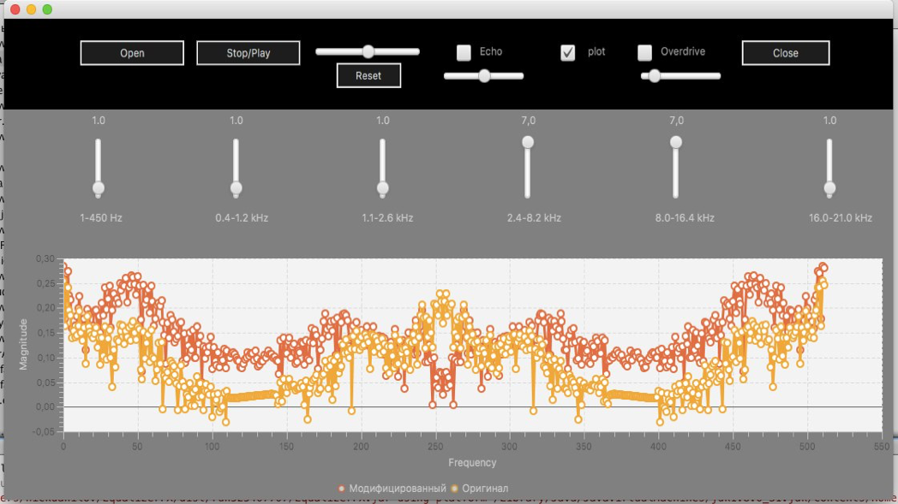

# DSP course project EqualizerFX
Equalizer for wav files on Java with effects (echo, overdrive).
Modeling of filters for different frequencies in Matlab and project transfer in Java with GUI (JavaFX).

